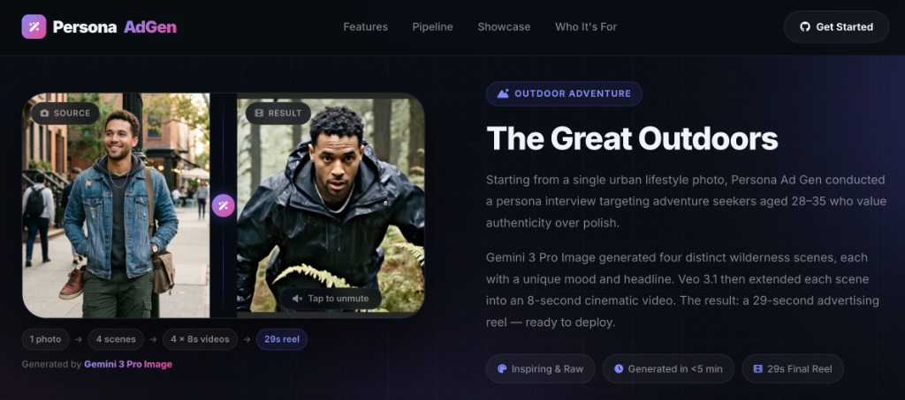

# Persona Ad Gen - AI-Powered Advertising Scene Generator

This project implements an AI-powered advertising content generator that transforms user photos into compelling, persona-driven advertising scenes. The agent guides users through a story-driven brief collection process, automatically generates headlines, and creates multiple advertising scenes tailored to specific target audiences. Powered by **Gemini 3 Pro Image**, **Veo 3.1**, **Gemini 3.1 Flash** & **ADK**.

**Live Showcase:** [https://mbettan.github.io/PersonaAdGen/](https://mbettan.github.io/PersonaAdGen/)



## Overview

The Persona Ad Gen agent is designed to revolutionize advertising content creation by focusing on the human story behind every great ad. Instead of traditional form-filling, it engages users in a conversational journey to understand their ideal customer's problems, desires, and motivations. The agent then leverages this deep understanding to generate visually compelling advertising scenes that resonate with the target audience.

## Agent Details

The key features of the Persona Ad Gen agent include:

| Feature            | Description                                      |
| ------------------ | ------------------------------------------------ |
| _Interaction Type_ | Conversational, Story-driven                    |
| _Complexity_       | Intermediate                                    |
| _Agent Type_       | Multi-Agent (Main + Creative Sub-agent)         |
| _Components_       | Tools, Image Generation, Multimodal             |
| _Vertical_         | Marketing/Advertising                            |

### Agent Architecture

The agent is built using a multi-agent architecture with specialized components:

1. **PersonaAdGenAgent (Main Orchestrator)**
   - Guides users through the 5-section story collection process
   - Manages session state and workflow progression
   - Coordinates with sub-agents for specialized tasks

2. **CreativeAgent (Sub-agent)**
   - Generates 4 unique advertising scenes based on the persona brief
   - Utilizes Gemini's image generation capabilities
   - Creates scene-specific prompts optimized for visual impact

3. **Headline Generation System**
   - Automatically creates compelling headlines after brief collection
   - Generates multiple options based on persona, message, and tone
   - Integrates seamlessly into the workflow without user intervention

### Workflow Stages

1. **The Ideal Customer (Persona)** - Understanding the target audience's problems and desires
2. **The 'Aha!' Moment (Core Message)** - Defining the solution in one powerful sentence
3. **The Conversation (Tone of Voice)** - Selecting the appropriate communication style
4. **The Creative Toolbox (Assets & Copy)** - Uploading base images and generating headlines
5. **The Targeting Signals (Audience Foundation)** - Collecting demographic and interest data

### Key Features

- **Story-Driven Brief Collection:**
  - Conversational approach to gathering advertising requirements
  - Focus on understanding customer problems rather than product features
  - Progressive disclosure of information needs

- **Automatic Headline Generation:**
  - Creates compelling headlines based on the collected persona story
  - Multiple variations to choose from
  - Tone-matched to the target audience

- **Multi-Scene Image Generation:**
  - Transforms uploaded images into 4 distinct advertising scenes
  - Each scene tells a different aspect of the brand story
  - Optimized for various marketing channels
  - Powered by **Gemini 3 Pro Image**

- **Cinematic Video Extension:**
  - Each scene is extended into an 8-second cinematic video by **Veo 3.1**
  - Native audio synchronization and 24 FPS temporal consistency
  - All four scenes are concatenated into a single, production-ready 29-second reel

- **Session State Management:**
  - Maintains context throughout the conversation
  - Stores brief details, images, and generated content
  - Enables seamless workflow progression

- **Artifact Management:**
  - Saves all generated images as downloadable artifacts
  - Organized naming convention for easy identification
  - Integration with Google Cloud Storage for persistence

### Tools

The agent has access to the following tools:

- `create_persona_brief_without_headlines(persona: str, core_message: str, tone: str, location: str, demographics: str, interests: str) -> dict`: Creates the initial persona brief structure before headline generation.

- `generate_headlines(persona: str, core_message: str, tone: str) -> list[str]`: Automatically generates compelling headlines based on the persona story.

- `save_image_as_artifact(image_data: str) -> str`: Processes and saves uploaded images as artifacts for scene generation.

- `confirm_and_save_persona_brief(brief: dict) -> str`: Saves the complete creative brief to session state.

- `edit_scene_image(base_image: str, scene_prompt: str, scene_number: int) -> str`: Generates new advertising scenes based on edit prompts using the uploaded image as source.

- `debug_save_image(image_data: str, filename: str) -> str`: Debug utility for image processing and storage operations.

## Setup and Installation

### Prerequisites

- Python 3.9+
- Poetry (for dependency management)
- Google ADK SDK
- Google Cloud Project (for Vertex AI integration) or Google AI Studio API key
- GCS bucket for artifact storage

### Installation

1. **Prerequisites:**

   For the Agent Engine deployment steps, you will need a Google Cloud Project. Once you have created your project, [install the Google Cloud SDK](https://cloud.google.com/sdk/docs/install). Then run the following command to authenticate with your project:
   ```bash
   gcloud auth login
   ```
   
   You also need to enable certain APIs. Run the following command to enable the required APIs:
   ```bash
   gcloud services enable aiplatform.googleapis.com storage.googleapis.com
   ```

2. Clone the repository:
   ```bash
   git clone https://github.com/mbettan/PersonaAdGen.git
   cd PersonaAdGen
   ```

3. Install dependencies using Poetry:

   If you have not installed poetry before then run `pip install poetry` first. Then you can create your virtual environment and install all dependencies using:

   **Note for Linux users:** If you get an error related to `keyring` during the installation, you can disable it by running the following command:
   ```bash
   poetry config keyring.enabled false
   ```
   This is a one-time setup.

   ```bash
   poetry install
   ```

   To activate the virtual environment run:
   ```bash
   poetry env activate
   ```

4. Install evaluation dependencies (optional):

   For running evaluation tests, you need additional dependencies:
   ```bash
   pip install "google-adk[eval]"
   
   # If using pipx for ADK installation
   pipx inject google-adk pandas tabulate rouge-score
   ```

5. Set up environment variables:

   Create a `.env` file in the project root with the following variables:
   ```bash
   # Google Cloud Project Configuration
   export GOOGLE_CLOUD_PROJECT=your-project-id
   export GOOGLE_CLOUD_LOCATION=us-central1
   
   # Artifact Storage Configuration
   export ADK_ARTIFACT_SERVICE_TYPE=GCS
   export ADK_GCS_BUCKET_NAME=your-bucket-name
   
   # For Vertex AI (set to true if using Vertex AI)
   export GOOGLE_GENAI_USE_VERTEXAI=true
   
   # For Google AI Studio (if not using Vertex AI)
   # export GOOGLE_GENAI_USE_VERTEXAI=false
   # export GOOGLE_API_KEY=your-api-key
   ```

## Running the Agent

You can run the agent using the ADK command in your terminal from the root project directory:

1. Run agent in CLI:

   ```bash
   adk run persona_ad_gen
   ```

2. Run agent with ADK Web UI:

   ```bash
   adk web
   ```
   
   The web interface will be available at the URL printed in the console (typically http://localhost:5000)

3. Alternative execution methods:

   ```bash
   # Using the run script (if available)
   ./run_agent.sh
   
   # Direct Python execution
   python -m adk.web_server --app persona_ad_gen
   ```

### Example Interaction

Here's a typical interaction flow with the agent:

**User:**
hello

**Agent:**
Great ads connect with a real person by solving a real problem. Instead of just filling out a form, we're going to build your ad's story step-by-step. First, let's get to know your ideal customer.

Describe the single person you want to reach. What is a key problem, need, or desire they are currently facing that your business can help with?

**User:**
I want to reach busy professionals in their 30s who struggle to find time for fitness but want to stay healthy and look good.

**Agent:**
Perfect! You're targeting busy professionals who value their health but struggle with time management. Now, let's capture the core message.

Now, imagine that person sees your ad. In one powerful sentence, what is the solution or key takeaway you want them to have? This is the core message that will form the heart of your ad.

**User:**
"Get fit in just 20 minutes a day with workouts that fit your schedule, not the other way around."

**Agent:**
Excellent core message! It directly addresses their time constraint while promising results. Now let's think about the tone.

How should we speak to this person? Choose a Tone of Voice that would resonate with them (e.g., Professional, Empathetic, Witty, Urgent, Conversational, Inspiring).

**User:**
Inspiring and empathetic - understanding their struggle but motivating them to take action.

**Agent:**
Perfect tone choice! Inspiring and empathetic will resonate well with busy professionals who need both understanding and motivation.

You've defined the story, now let's gather the materials. Upload your most compelling image that will serve as the foundation for your advertising scenes.

[User uploads image]

**Agent:**
Perfect! Now I'll automatically generate compelling headlines for you based on your story.

```tool_code
generate_headlines(
    persona="busy professionals in their 30s struggling with time for fitness",
    core_message="Get fit in just 20 minutes a day with workouts that fit your schedule",
    tone="Inspiring and empathetic"
)
```

```tool_outputs
[
    "Your Schedule. Your Workout. Your Success.",
    "20 Minutes to Transform: Fitness That Fits Your Life",
    "Busy Schedule? We Get It. 20 Minutes Is All You Need.",
    "From Boardroom to Better Health in 20 Minutes",
    "Finally, Fitness That Respects Your Time"
]
```

## Evaluating the Agent

Evaluation tests assess the agent's conversation flow and response accuracy.

**Steps:**

1. **Run Evaluation Tests:**

   ```bash
   adk eval persona_ad_gen eval/data/persona_ad_gen_evalset.test.json
   ```

   Expected output:
   ```
   Eval Run Summary
   persona_ad_gen_evalset:
     Tests passed: 2
     Tests failed: 0
   ```

2. **Run Unit Tests:**

   ```bash
   pytest eval/test_eval.py
   ```

   This runs specific test cases including:
   - `test_agent_introduction` - Verifies the agent provides the correct introduction

### Automated End-to-End Testing

For a full, unattended validation of the agent (including headline and image generation), you can use the provided test utility. This script simulates a complete user interaction flow.

**Steps:**

1.  **Ensure Environment Variables are Set**: Ensure `GOOGLE_CLOUD_PROJECT`, `GOOGLE_CLOUD_LOCATION`, and `ADK_GCS_BUCKET_NAME` are either in your `.env` file or exported in your shell.

2.  **Run the Test Script**:
    ```bash
    poetry run python run_persona_test.py docs/assets/example_scene.jpg
    ```

The script will iterate through a pre-defined conversation, process the image, and generate advertising scenes, saving them as artifacts in the `.adk/artifacts/` directory.

## Configuration

The agent uses the following models:
- **Main Agent:** `gemini-3-flash-preview` for conversation and reasoning
- **Scene Transformation:** `gemini-3-pro-image-preview` for transforming base images into ad scenes
- **Video Extension:** `veo-3.1-generate-001` for extending scenes into cinematic 8-second videos

You can modify these in `persona_ad_gen/agent.py`:

```python
MODEL = "gemini-3-flash-preview"  # Change this to use a different model
```

### Session State Structure

The agent maintains the following session state:

```python
{
    "confirmed_brief": {
        "persona": str,
        "core_message": str,
        "tone": str,
        "location": str,
        "demographics": str,
        "interests": str
    },
    "base_image_filename": str,
    "headlines": list[str],
    "generated_scenes": list[str]
}
```

## Deployment on Google Agent Engine

To deploy the agent to Vertex AI Agent Engine:

1. **Install deployment dependencies:**

   ```bash
   poetry install --with deployment
   ```

2. **Deploy the agent:**

   ```bash
   python deployment/deploy.py --create
   ```

3. **List deployed agents:**

   ```bash
   python deployment/deploy.py --list
   ```

4. **Delete a deployment**:
   ```bash
   python deployment/deploy.py --delete --resource_id=AGENT_ENGINE_ID
   ```

## Integration with Gemini Enterprise

You can register your Persona Ad Gen agent to be used within Gemini Enterprise applications. This allows users to access your custom ad generation capabilities directly through the Gemini for Google Cloud interface.

### Registration Steps

1.  **Deploy your Agent**: Follow the [Deployment](#deployment-on-google-agent-engine) steps above to host your agent on Vertex AI Agent Engine.
2.  **Get the Resource Path**: Obtain the Agent Engine resource path for your deployed agent. The format is:
    `https://LOCATION-aiplatform.googleapis.com/v1/projects/PROJECT_ID/locations/LOCATION/reasoningEngines/ADK_RESOURCE_ID`
3.  **Register in Gemini Enterprise**:
    - Navigate to the [Gemini Enterprise](https://console.cloud.google.com/gemini-enterprise/) page in the Google Cloud console.
    - Choose the specific application you want to add the agent to.
    - Go to **Agents** > **Add agent** > **Custom agent via Agent Engine**.
    - Enter a display name and a description that helps the model understand when to invoke the agent.
    - Paste the resource path from Step 2.
4.  **Configure Authorizations**: If your agent needs to access Google Cloud resources on behalf of the user, set up the required authorizations in the panel.

For more details, see the [Official Registration Guide](https://docs.cloud.google.com/gemini/enterprise/docs/register-and-manage-an-adk-agent#register-an-adk-agent).

### Testing Deployment

This code snippet shows how to test the deployed agent:

```python
import dotenv
from vertexai import agent_engines

# Load environment variables
dotenv.load_dotenv()

# Initialize connection to deployed agent
agent_engine_id = "YOUR_AGENT_ENGINE_ID"  # Replace with actual ID
agent_engine = agent_engines.get(agent_engine_id)

# Create a new session
session = agent_engine.create_session(user_id="test_user")

# Stream interaction with the agent
for event in agent_engine.stream_query(
    user_id=session["user_id"],
    session_id=session["id"],
    message="Hello, I need help creating an ad campaign"
):
    for part in event["content"]["parts"]:
        print(part["text"])
```

## Project Structure

```
PersonaAdGen/
├── docs/                       # Marketing website & GitHub Pages source
├── persona_ad_gen/             # Main agent source code
│   ├── __init__.py
│   ├── agent.py                # Main agent definition and orchestration
│   ├── tools.py                # Core tool implementations
│   ├── ...
│   └── sub_agents/             # Specialized sub-agents
├── eval/                       # Evaluation and unit tests
│   ├── test_eval.py            # Unit tests for agent behavior
│   └── data/                   # Evaluation test cases
├── run_persona_test.py         # End-to-end test utility
└── pyproject.toml              # Project dependencies and configuration
```

## Troubleshooting

### Common Issues and solutions

1. **Evaluation module not found:**
   ```bash
   # Solution: Install eval dependencies
   pipx inject google-adk pandas tabulate rouge-score
   ```

2. **Authentication errors:**
   ```bash
   # Solution: Authenticate with Google Cloud
   gcloud auth application-default login
   ```

3. **Image generation failures:**
   - Verify that `GOOGLE_GENAI_USE_VERTEXAI` is correctly set
   - Check API quotas and limits in your Google Cloud project
   - Ensure the model `gemini-3-pro-image-preview` is available in your region

4. **Missing environment variables:**
   - Ensure all required variables are set in your `.env` file
   - Verify the GCS bucket exists and you have write permissions

## Disclaimer

This agent sample is provided for illustrative purposes only and is not intended for production use. It serves as a basic example of an agent and a foundational starting point for individuals or teams to develop their own agents.

This sample has not been rigorously tested, may contain bugs or limitations, and does not include features or optimizations typically required for a production environment (e.g., robust error handling, security measures, scalability, performance considerations, comprehensive logging, or advanced configuration options).

Users are solely responsible for any further development, testing, security hardening, and deployment of agents based on this sample. We recommend thorough review, testing, and the implementation of appropriate safeguards before using any derived agent in a live or critical system.

## License

Apache License 2.0
